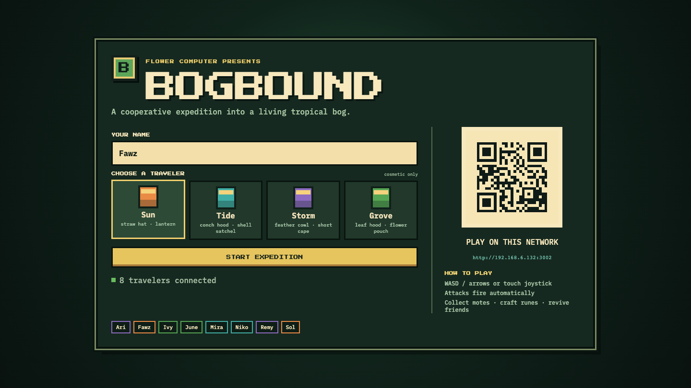
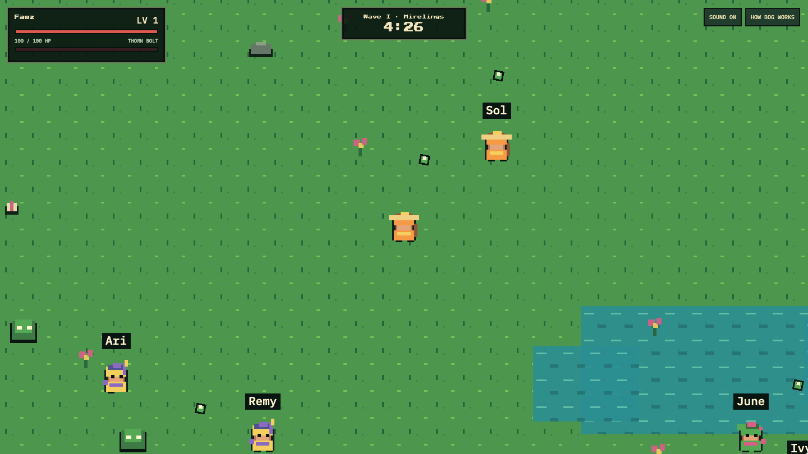
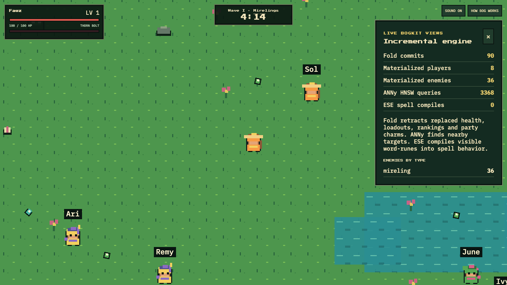

# Bogbound

**A 1–20 player tropical survivors RPG, powered by BogKit.**

Every phone or laptop becomes its own viewport into one shared expedition. Move through the bog, auto-target monsters, collect XP, build a spell from word-runes, revive fallen travelers, and defeat the Fen Colossus before the five-minute timer expires.

<p align="center">
  
</p>

## The expedition

- Survive four escalating waves and a final boss, alone or with up to 20 players.
- Move with WASD, arrow keys, or the phone joystick; attacks aim and fire automatically.
- Collect XP, choose run-defining blessings, discover semantic word-runes, and revive nearby teammates.
- Join late, reconnect safely, or rematch from the shared results screen.

<table>
  <tr>
    <td width="50%" align="center"></td>
    <td width="50%" align="center"></td>
  </tr>
  <tr>
    <td align="center"><sub>One authoritative world, one viewport per player</sub></td>
    <td align="center"><sub>Live incremental views and search activity</sub></td>
  </tr>
</table>

## BogKit under the hood

| Tool | Role in the game |
|---|---|
| **Fold** | Meaningful keyed facts—health, enemy state, progression, loadouts, damage, and party charms—replace their previous values and incrementally update materialized counts, rankings, and indexes. Its live party-health, DPS, downed-player, and enemy views drive an adaptive director that changes real spawn pace and enemy composition. |
| **ANNy** | Live 2D HNSW searches select auto-aim targets, enemy aggro, homing and chain targets, loot collection, and nearby teammates for revives. |
| **ESE** | Static 512-dimensional embeddings interpret mysterious rune phrases locally, then ANNy genuinely determines the nearest of 16 designed element/form spell behaviors. No model server or internet request is involved. |

Fast-changing positions and projectiles stay in the authoritative Rust simulation; meaningful state changes flow through Fold. The simulation reads Fold's materialized state back on the next tick, so the adaptive director eases off when a party is struggling and escalates when it is dominating. The optional **How Bog Works** panel exposes the live decision alongside commit, materialization, HNSW-query, and spell-compile counters.

## Run

From the BogKit repository root:

```bash
cargo run -p bogbound
```

Open [http://localhost:3000](http://localhost:3000). Everyone else on the same network can scan the lobby QR code or open its displayed LAN URL. The production React client is already bundled; no additional setup is required.

For an accelerated judging walkthrough:

```bash
BOGBOUND_TIME_SCALE=10 cargo run -p bogbound
```

## Stack

Rust · Axum · WebSockets · Fold · ANNy · ESE · React · TypeScript · Phaser
